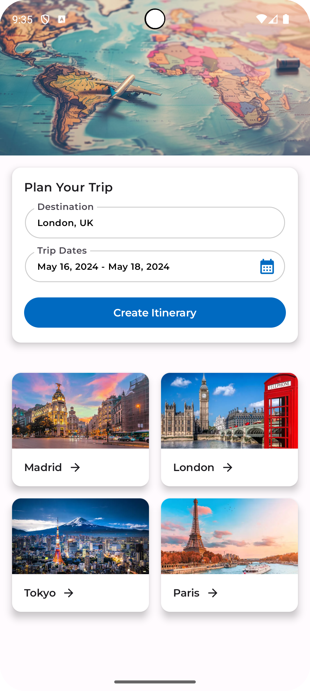
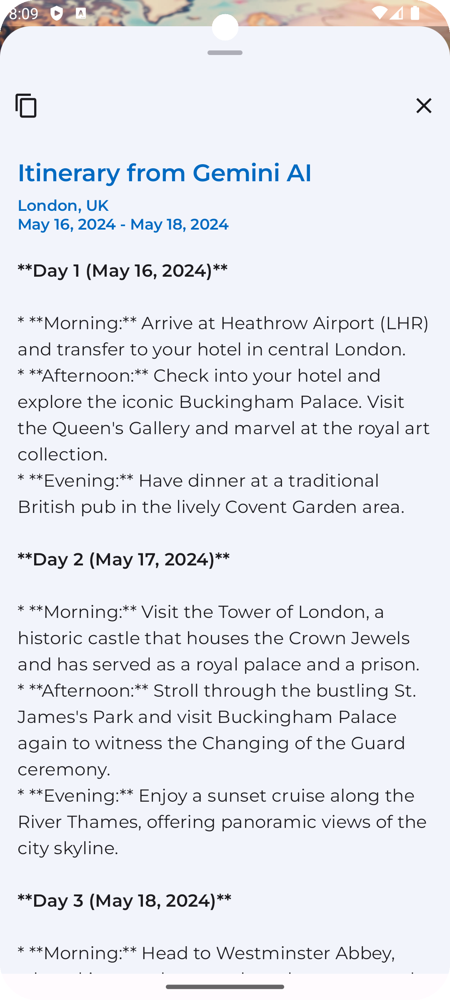

# Google Gemini AI Travel Planner

An Android prototype application for planning a travel itinerary based on generative AI responses from Google's Gemini API

<br>

| Demo Video                                                                   | Itinerary Planning Screen                                                        | Itinerary from Gemini AI                                                         |
|------------------------------------------------------------------------------|----------------------------------------------------------------------------------|----------------------------------------------------------------------------------|
|  |  |  |

<br>

## Project Overview

### Features

* The user can type in a location or select from one of four quick-select location buttons
* The user selects a date range that corresponds to the start & end date of the trip that they are planning on taking
* The GeoApify API validates the location that the user enters
* Upon successful validation from the the GeoApify API, the Google Gemini generative AI API is prompted to create an itinerary corresponding to the location & dates that the user entered
* The generative AI response from the Gemini AI is displayed to the user

### Dependencies

* Android Architecture Components (MVVM)
* Material 3 Jetpack Compose UI Components
* Jetpack Navigation Compose
* Hilt/Dagger for Dependency Injection
* Retrofit & OkHttp for HTTP calls
* Moshi for JSON parsing
* Coroutines for concurrency & asynchronous operations

## Modules

* `:app` module for the application's scaffolding
* `:feature:itinerary-planner` module for the Itinerary Planner feature

## APIs

### Loading API Keys from `local.properties`

This project is set up to retrieve the necessary API keys from `local.properties` by default. You will need to add your API keys to `local.properties` for the APIs mentioned below. This section in `build.gradle.kts` within the `app` module retrieves the API keys from `local.properties`:

```
        //load the api keys from local.properties
        val keystoreFile = project.rootProject.file("local.properties")
        val properties = Properties()
        properties.load(keystoreFile.inputStream())
        val geminiAPIKey = properties.getProperty("geminiAPIKey") ?: ""
        val geoApifyAPIKey = properties.getProperty("geoApifyAPIKey") ?: ""
```

### GeoApify API

This app uses the GeoApify Geocoding API to validate the locations entered by the users. To use the API, you will need to obtain an API key from https://www.geoapify.com/geocoding-api and add it to the project's `local.properties`.

### Google Gemini API

This app uses the Google Gemini API to develop a generative AI itinerary based on the entered location and dates. To use the API, you will need to obtain an API key from https://ai.google.dev/gemini-api/docs/api-key and add it to the project's `local.properties`.